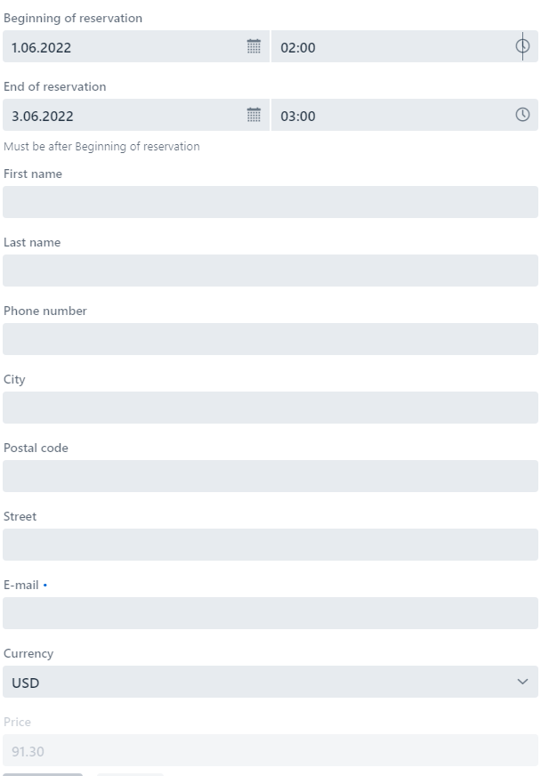
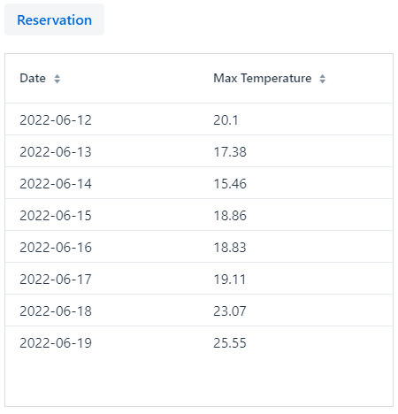
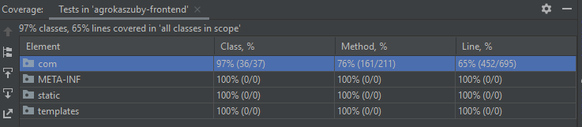

# Agrokaszuby-Frontend

### **Features**:
* **F1** - Flat reservation
* **F2** - Related tables
* **F3** - [Frontend] Weather API - Forecast for seven days
* **F4** - [Frontend] Currency exchange API - Add Price with PLN and USD
* **F5** - Reservation form validation
* **F6** - Design patterns
* **F7** - [Backend] Scheduler - sending email with all reservations each day
* **F8** - Application instruction
* **F9** - Currency exchange REST API
* **F10** - Question feature
* **F11** - Comment feature
* **F12** - Comment Log feature
* **F13** - Question Log feature
* **F14** - Reservation Log feature
* **F15** - Test coverage

#### GitHub repo

------
* Frontend: https://github.com/KatarzynaNabozny/Agrokaszuby-Frontend
------
Port: http://localhost:8080/

##### To run Frontend you need to run **AgrokaszubyFrontApplication.java**

## 2. API (Data download - F3, F4)
### Currency
GET: https://openexchangerates.org/api/latest.json?app_id=bdf9664efe044ad1b1821463563b756d&symbols=PLN \
This is used in CurrencyExchangeService.java. \
Needed to calculate price of reservation which is calculated when client will fill beginning, end of reservation and currency. \
Then price will appear like below:

### Weather
GET: https://api.openweathermap.org/data/2.5/onecall?lat=54.45169&lon=18.21428&appid=29dfcc1425030e06fc5850aa06fc9ce1&lang=en&units=metric&exclude=current,minutely,hourly

To display one week forecast (in °C) for Destination of Hotel Agrokaszuby on main view as a table:

## 4. Data base saving 
1. Saving Reservation - when press save on reservation form. This is saved in RESERVATION table
2. Saving Customer - when press save on reservation form. This is saved in CUSTOMER table
3. Removing reservation - when pres delete on reservation form \
needed to provide email, start ane end date. This is removed from RESERVATION table
4. Saving currency exchange when changing currency for USD in Reservation form. \
Then PriceService invokes CurrencyExchangeService. This is saved in CURRENCY_EXCHANGE table
5. Saving comment on 'Leave a comment' form, when pressing Send button. This is saved to COMMENT table 
6. Removing comment on 'Leave a comment' form, when pressing Rollback button. This is removed from COMMENT table \
   needed to provide email and subject.
7. Saving question on 'Question' form, when pressing Send button. This is saved to QUESTION table
8. Removing question on 'Question' form, when pressing Rollback button. This is removed from QUESTION table \
   needed to provide email and subject.
9. Saving Comment Log information when user will press save or rollback. This is saved in COMMENT_LOG table
10. Saving Question Log information when user will press save or rollback. This is saved in QUESTION_LOG table
11. Saving Reservation Log information when user will press save or delete. This is saved in RESERVATION_LOG table

## 5. TESTS - Coverage 65% (F15)

## 6. Design patterns (F6, F3)
* Builder - Reservation  (F6)
* Singleton - WeatherService (F3), ReservationService (F2)

## 7. View Layer in Vaadin (F5)
There are views:
* Main view - From this view you can go to reserve a hotel -MainView.java
* Reservation view - You can make a reservation or delete it -ReservationForm.java

#### GitHub repo

------
* Backend: https://github.com/KatarzynaNabozny/Agrokaszuby-Backend
------